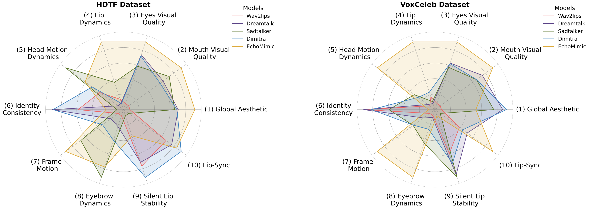

# THEval - Evaluation Framework For Talking Head Generation

[](https://arxiv.org/abs/2503.complete)
[](https://newbyl.github.io/THEval_Project_Page/)

This repository contains the official implementation  for the paper "THEval - Evaluation Framework For Talking Head Generation".

## 📎 Table of content

- [Updates](#updates)
- [Overview](#overview)
- [Evaluation Results](#evaluation_results)
- [Leaderboard](#leaderboard)
- [Installation](#installation)
- [Usage](#usage)
- [Citation and Acknowledgement](#citation_and_acknowledgement)


## 🔥 Updates
- [03/2025] **Code released and [project page](https://newbyl.github.io/THEval_Project_Page) released !** 

## Overview 


We introduce <strong>THEval</strong>, a comprehensive framework for evaluating <strong>Talking Head (TH) Generation</strong>. THEval assesses <em>video quality, naturalness, and synchronization</em> using a set of <strong>10 carefully designed metrics</strong>.By combining <em>algorithmic and perceptual</em> evaluations, it enables a fine-grained and objective assessment of TH generation models. To address the limitations of existing evaluation methods, we structure THEval into three core <strong>evaluation dimensions</strong>. <em>Video Quality</em> measures aesthetic appeal and region-specific quality (mouth, eyes). <em>Naturalness</em> captures the realism of generated expressions, head motions, lip dynamics, and eyebrow movements. <em>Synchronization</em> evaluates the alignment between lip movements and speech, as well as silent lip stability. For each dimension, we introduce a <strong>Metric Suite</strong>, ensuring an adaptive and fair assessment across different TH generation approaches. THEval also incorporates <strong>human preference studies</strong>, demonstrating strong correlation between its evaluation results and subjective user ratings. Our experiments on <strong>state-of-the-art TH models</strong> highlight that while many methods achieve strong lip synchronization, challenges remain in generating <em>expressive and artifact-free</em> TH videos. THEval serves as a <strong>benchmarking tool</strong> to guide the development of more robust and trustworthy generative models, continuously evolving to assess new advancements in the field.

## 📋​ Evaluation Results

We provide evaluation results for <strong>5 state-of-the-arttalking head generation models</strong>  (see the <strong>radar chart below for visualization</strong>)



Below is are the numerical results of THEval accross the 10 dimensions for <strong>HDTF dataset</strong> : 


|   | **(1) Global Aesthetics ↑** | **(2) Mouth Quality ↑** | **(3) Eyes Quality ↑** | **(9) Silent Lip Stability ↓** | **(10) Lip-Sync ↓**  |
| --- | --- | --- | --- | --- | --- |
|  Wav2Lip | 2.2850 | 1.2528 | 2.4007 | 5.2606 | 0.2216  |
|  DreamTalk | 2.6934 | 1.3389 | 2.4804 | 5.6214 | 0.2029  |
|  SadTalker | 2.6631 | 1.3544 | 2.4617 | 10.1779 | 0.3453  |
|  Dimitra | 2.6826 | 1.3314 | 2.4784 | 4.1475 | 0.1714  |
|  EchoMimic | 2.8342 | 1.3845 | 2.5016 | 8.2121 | 0.1867  |
|  Original Videos | 2.8999 | 1.3593 | 2.5029 | 7.1291 | 0.1803  |
|   | **(4) Lip Dynamics ↑** | **(5) Head Motion Dynamics ↑** | **(6) Identity Consistency ↓** | **(7) Frame Motion ↑** | **(8) Eyebrow Dynamics ↑**  |
|  Wav2Lip | 1.4651 | 1.005 | 0.005822 | 0.2104 | 0.002049  |
|  DreamTalk | 1.3473 | 0.740 | 0.004589 | 0.4943 | 0.002665  |
|  SadTalker | 2.0329 | 1.497 | 0.007674 | 1.6584 | 0.005580  |
|  Dimitra | 1.3214 | 1.115 | 0.004635 | 0.8162 | 0.003456  |
|  EchoMimic | 1.6996 | 1.216 | 0.007151 | 2.2426 | 0.004988  |
|  Original Videos | 1.6191 | 1.764 | 0.009047 | 1.7621 | 0.005601  |

And for <strong>VoxCeleb</strong> dataset : 

|   | **(1) Global Aesthetics ↑** | **(2) Mouth Quality ↑** | **(3) Eyes Quality ↑** | **(9) Silent Lip Stability ↓** | **(10) Lip-Sync ↓**  |
| --- | --- | --- | --- | --- | --- |
|  Wav2Lip | 1.4100 | 1.2452 | 1.2885 | 8.1632 | 0.2530  |
|  DreamTalk | 1.5506 | 1.2873 | 1.3477 | 5.9911 | 0.2465  |
|  SadTalker | 1.5301 | 1.2814 | 1.3414 | 5.7143 | 0.2688  |
|  Dimitra | 1.5569 | 1.2815 | 1.3470 | 7.1682 | 0.2502  |
|  EchoMimic | 1.4889 | 1.2977 | 1.3787 | 12.0730 | 0.2254  |
|  Original Videos | 1.5344 | 1.2601 | 1.3210 | 9.9341 | 0.2402  |
|   | **(4) Lip Dynamics ↑** | **(5) Head Motion Dynamics ↑** | **(6) Identity Consistency ↓** | **(7) Frame Motion ↑** | **(8) Eyebrow Dynamics ↑**  |
|  Wav2Lip | 1.7663 | 1.6249 | 0.007344 | 0.2792 | 0.005194  |
|  DreamTalk | 1.4026 | 1.7100 | 0.007243 | 0.7894 | 0.005351  |
|  SadTalker | 1.5120 | 2.3797 | 0.01212 | 1.6299 | 0.007759  |
|  Dimitra | 2.0383 | 2.1940 | 0.008741 | 1.6028 | 0.006462  |
|  EchoMimic | 2.4391 | 4.1951 | 0.019762 | 4.5600 | 0.010986  |
|  Original Videos | 2.2913 | 4.8049 | 0.02014 | 5.4643 | 0.010910  |

## 🏆 Learderboard

Coming Soon...

## Installation

In order to install THEval you first need to clone the repo : 

```
git clone https://github.com/Newbyl/THEval.git
```

Then setup the environment environment :

```
conda create -n theval python=3.9 -y
conda activate theval
pip install -r requirements.txt
```

For the <strong>head motion dynamics</strong> metric follow the instruction in `models/facexformer/README.md`.

## Usage

To use any of the 10 metrics you only have to go in the folder where is located the metric that you want results from, then use the following command (except head motion dynamics, the pattern remains the same) : 

```
python metric_name.py --video_txt ../input.txt --output_txt output.txt
```

Each metric takes in input a text file that contains all the paths to the videos that you want to evaluate. The results of the evaluation are then saved into the `output.txt` file (you can rename it as you want).

## Citation

If you liked our work and found it useful, please consider citing our paper :

```
@article{quignon2025theval,
        title={THEval: A Comprehensive Framework for Evaluating Talking Head Generation},
        author={Quignon, Nabyl and  Chopin, Baptiste and  Wang, Yaohui and Dantcheva, Antitza},
        journal={arXiv preprint arXiv:2503.Complete},
        year={2025}
      }
```


