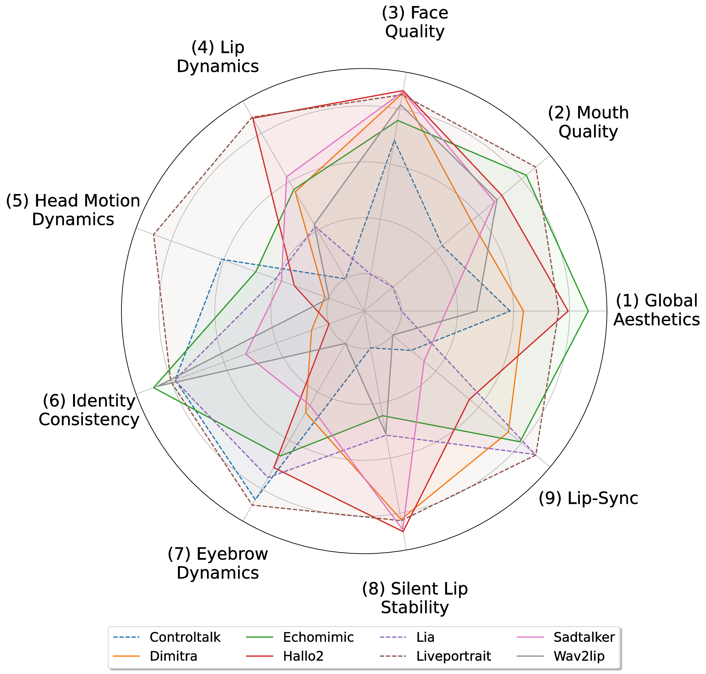

# THEval - Evaluation Framework For Talking Head Generation


[]()
[]()

This repository contains the official implementation  for the paper "THEval - Evaluation Framework For Talking Head Generation".

## 📎 Table of content

- [Updates](#updates)
- [Overview](#overview)
- [Evaluation Results](#evaluation_results)
- [Leaderboard](#leaderboard)
- [Installation](#installation)
- [Usage](#usage)
- [Citation and Acknowledgement](#citation_and_acknowledgement)


## 🔥 Updates
- [07/2025] **Code released** 

## Overview 


We present **THEval**, a new evaluation framework designed to address the limitations of current metrics for Talking Head (TH) generation. While video generation has advanced rapidly, evaluation methods have not kept pace. THEval offers a comprehensive assessment using 9 metrics across three dimensions: (i) **Video Quality**, (ii) **Naturalness**, and (iii) **Synchronization**.

Our framework combines algorithmic and perceptual considerations, allowing for fine-grained analysis of factors like head movement, facial behavior, and audio-visual alignment, all while being computationally efficient. We conducted extensive experiments on over 5,000 videos from state-of-the-art TH models, generated from a novel dataset. Our findings indicate that while many models achieve strong lip synchronization, generating expressiveness and artifact-free details remains a challenge. THEval serves as a benchmarking tool to guide the development of more robust generative models.


## 📋​ Evaluation Results

We provide evaluation results for <strong>8 state-of-the-art talking head generation models</strong> separated in two categories, namely, Video Driven and Audio Driven  (see the <strong>radar chart below for visualization</strong>)

<p align="center">

</p>


Below is are the numerical results of THEval accross the 9 dimensions for <strong>our test dataset</strong> : 


| Model         | (1) Global Aesthetics ↓ | (2) Mouth Quality ↓ | (3) Face Quality ↓ | (8) Silent Lip Stability ↓ | (9) Lip-Sync ↓ |
|---------------|-------------------------|---------------------|--------------------|----------------------------|----------------|
| **Video Driven** |                         |                     |                    |                            |                |
| Liveportrait | 0.0538                  | 0.0572              | 0.0251             | 0.0369                     | 0.0040         |
| Controltalk | 0.1069                  | 0.3908              | 0.1050             | 0.4656                     | 0.3590         |
| Lia       | 0.2257                  | 0.5669              | 0.3403             | 0.2490                     | 0.0060         |
| **Audio Driven** |                         |                     |                    |                            |                |
| Hallo2     | 0.0435                  | 0.1779              | 0.0178             | 0.0098                     | 0.1930         |
| Echomimic | 0.0215                  | 0.0913              | 0.0703             | 0.2973                     | 0.0490         |
| Dimitra   | 0.0923                  | 0.2866              | 0.0223             | 0.0398                     | 0.0820         |
| Sadtalker | 0.1768                  | 0.2046              | 0.0199             | 0.0146                     | 0.3220         |
| Wav2lip  | 0.1433                  | 0.1956              | 0.0426             | 0.2524                     | 0.4110         |

| Model         | (4) Lip Dynamics ↓ | (5) Head Motion Dynamics ↓ | (6) Identity Consistency ↓ | (7) Eyebrow Dynamics ↓ | Final Score ↓ |
|---------------|--------------------|----------------------------|----------------------------|------------------------|---------------|
| **Video Driven** |                    |                            |                            |                        |               |
| Liveportrait | 0.0150             | 0.0453                     | 0.1546                     | 0.0200                 | 0.4119        |
| Controltalk | 0.7767             | 0.0913                     | 0.1658                     | 0.0146                 | 2.4756        |
| Lia      | 0.5301             | 0.1278                     | 0.1647                     | 0.0732                 | 2.2837        |
| **Audio Driven** |                    |                            |                            |                        |               |
| Hallo2    | 0.0201             | 0.1404                     | 0.5610                     | 0.0996                 | 1.2631        |
| Echomimic | 0.3553             | 0.1144                     | 0.1106                     | 0.1307                 | 1.2404        |
| Dimitra   | 0.3668             | 0.1611                     | 0.5160                     | 0.2459                 | 1.8127        |
| Sadtalker | 0.2959             | 0.1317                     | 0.3470                     | 0.2654                 | 1.7778        |
| Wav2lip  | 0.5209             | 0.1639                     | 0.1200                     | 0.4295                 | 2.2792        |

## 🏆 Learderboard

Coming Soon...

## Installation

In order to install THEval you first need to clone the repo : 

```
git clone https://github.com/Newbyl/THEval.git
```

Then setup the environment environment :

```
conda create -n theval python=3.9 -y
conda activate theval
pip install -r requirements.txt
```

For the <strong>head motion dynamics</strong> metric follow the instruction in `models/facexformer/README.md`.

## Usage

To use any of the 9 metrics you only have to go in the folder where is located the metric that you want results from, then use the following command (except head motion dynamics, the pattern remains the same) : 

```
python metric_name.py --video_txt ../input.txt --output_txt output.txt
```

Each metric takes in input a text file that contains all the paths to the videos that you want to evaluate. The results of the evaluation are then saved into the `output.txt` file (you can rename it as you want).

## Citation

If you liked our work and found it useful, please consider citing our paper :

```
@article{quignon2025theval,
        title={THEval: A Comprehensive Framework for Evaluating Talking Head Generation},
        author={Quignon, Nabyl and  Chopin, Baptiste and  Wang, Yaohui and Dantcheva, Antitza},
        journal={arXiv preprint arXiv:2503.Complete},
        year={2025}
      }
```


