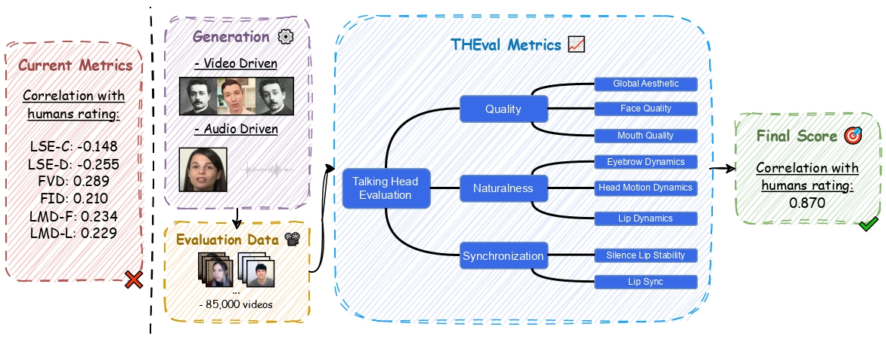

# THEval

Official implementation of **THEval: Evaluation Framework for Talking Head Video Generation**.

[🌐 Project Page](https://newbyl.github.io/theval_project_page/) | [📄 Paper](https://arxiv.org/pdf/2511.04520)

THEval evaluates talking-head videos with eight metrics grouped into three
dimensions: **quality**, **naturalness**, and **synchronization**. Each metric is
normalized by its closeness to the ground-truth value of the evaluation set, and
the final score is the unweighted average of the eight normalized metrics.
**Higher is better.**

<p align="center">
  
</p>

## Metrics

THEval contains the following metrics:

| Dimension | Metrics |
| --- | --- |
| Quality | Global Aesthetics, Mouth Quality, Face Quality |
| Naturalness | Lip Dynamics, Head Motion Dynamics, Eyebrow Dynamics |
| Synchronization | Silent Lip Stability, Lip-Sync |

The final score is computed as:

```text
score_m = 1 - abs(method_m - GT_m) / abs(GT_m)
final_score = mean(score_m for all eight metrics)
```

## Leaderboard

Results from the paper on the THEval evaluation dataset. All metric values are
normalized scores, and higher is better.

| Rank | Model | Type | Global Aesthetics | Mouth Quality | Face Quality | Lip Dynamics | Head Motion | Eyebrow Dynamics | Silent Lip Stability | Lip-Sync | Final Score |
| ---: | --- | --- | ---: | ---: | ---: | ---: | ---: | ---: | ---: | ---: | ---: |
| 1 | LivePortrait | Video-driven | 0.9464 | 0.9760 | 0.8784 | 0.9913 | 0.7548 | 0.9997 | 0.9316 | 0.9980 | 0.9345 |
| 2 | X-Portrait | Video-driven | 0.9502 | 0.9990 | 0.9568 | 0.9611 | 0.6091 | 0.7897 | 0.9924 | 0.9407 | 0.8999 |
| 3 | LIA-X | Video-driven | 0.9466 | 0.9195 | 0.8705 | 0.9030 | 0.6233 | 0.9090 | 0.9087 | 0.9644 | 0.8806 |
| 4 | Hallo2 | Audio-driven | 0.9619 | 0.9254 | 0.9017 | 0.9883 | 0.2395 | 0.8530 | 0.9620 | 0.9502 | 0.8477 |
| 5 | Echomimic | Audio-driven | 0.8499 | 0.9617 | 0.9514 | 0.7930 | 0.3806 | 0.8071 | 0.8251 | 0.9964 | 0.8207 |
| 6 | EmoPortrait | Video-driven | 0.9542 | 0.8799 | 0.7957 | 0.9159 | 0.5136 | 0.5840 | 0.9354 | 0.9608 | 0.8174 |
| 7 | OmniAvatar | Audio-driven | 0.9767 | 0.9919 | 0.9521 | 0.4650 | 0.6039 | 0.8488 | 0.6160 | 0.9972 | 0.8064 |
| 8 | FLOAT | Audio-driven | 0.8713 | 0.9868 | 0.9645 | 0.4266 | 0.5115 | 0.8945 | 0.6958 | 0.9992 | 0.7938 |
| 9 | ControlTalk | Video-driven | 0.7759 | 0.8360 | 0.7584 | 0.5476 | 0.5058 | 0.9785 | 0.9163 | 0.9897 | 0.7885 |
| 10 | Dimitra | Audio-driven | 0.9523 | 0.8798 | 0.7914 | 0.7863 | 0.1279 | 0.6372 | 0.8555 | 0.9430 | 0.7467 |
| 11 | SadTalker | Audio-driven | 0.9576 | 0.9142 | 0.6005 | 0.8276 | 0.2867 | 0.6084 | 0.6806 | 0.9794 | 0.7319 |
| 12 | MCNet | Video-driven | 0.7499 | 0.7655 | 0.4771 | 0.8925 | 0.2297 | 0.9132 | 0.8669 | 0.9541 | 0.7311 |
| 13 | DaGAN | Video-driven | 0.7547 | 0.7646 | 0.5105 | 0.8262 | 0.3029 | 0.8362 | 0.7452 | 0.9719 | 0.7140 |
| 14 | FOM | Video-driven | 0.7516 | 0.7566 | 0.4875 | 0.6743 | 0.3269 | 0.8613 | 0.5970 | 0.9929 | 0.6810 |
| 15 | LIA | Video-driven | 0.7265 | 0.7622 | 0.4899 | 0.6912 | 0.3080 | 0.8920 | 0.5741 | 0.9913 | 0.6794 |
| 16 | Real3DPortrait | Audio-driven | 0.8597 | 0.8732 | 0.7934 | 0.7348 | 0.0895 | 0.3170 | 0.7072 | 0.9695 | 0.6680 |
| 17 | Wav2Lip | Audio-driven | 0.9090 | 0.9180 | 0.6762 | 0.6966 | 0.1124 | 0.3662 | 0.6388 | 0.8849 | 0.6502 |

## Installation

THEval needs Python and `ffmpeg`. We recommend installing it with conda:

```bash
git clone https://github.com/Newbyl/THEval.git
cd THEval
conda create -n theval python=3.10 -y
conda activate theval
```

Then install the environment with:

```bash
bash install.sh
pip install -e .
```

Download the external model code and checkpoints:

```bash
python tools/download_external_models.py --all
```

This installs the model files expected by the metric scripts:

```text
models/facexformer/ckpts/model.pt                  # Head Motion Dynamics
```

## Prepare Videos

Create a text file with one video path per line:

```bash
theval-list-videos /path/to/my_method_videos -o input_files/my_method.txt
```

## Run The Metrics

Run each metric script from the repository root. Every script reads the same
video list and writes one output file.

### Quality

```bash
python Video_Quality/global_aesthetic.py --video_txt input_files/my_method.txt --output_txt output_files/my_method/global_aesthetic.csv
python Video_Quality/mouth_quality.py --video_txt input_files/my_method.txt --output_txt output_files/my_method/mouth_quality.csv
python Video_Quality/face_quality.py --video_txt input_files/my_method.txt --output_txt output_files/my_method/face_quality.csv
```

### Naturalness

```bash
python Naturalness/lip_dynamics.py --video_txt input_files/my_method.txt --output_txt output_files/my_method/lip_dynamics.csv
python Naturalness/head_motion_dynamics.py --video_txt input_files/my_method.txt --output_txt output_files/my_method/head_motion_dynamics.csv
python Naturalness/eyebrow_dynamics.py --video_txt input_files/my_method.txt --output_txt output_files/my_method/eyebrow_dynamics.csv
```

### Synchronization

```bash
python Synchronization/silent_lip_stability.py --video_txt input_files/my_method.txt --output_txt output_files/my_method/silent_lip_stability.csv
python Synchronization/lip_sync.py --video_txt input_files/my_method.txt --output_txt output_files/my_method/lip_sync.csv
```

For `lip_sync.py` and `silent_lip_stability.py`, you can pass
`--audio_folder /path/to/wavs` if the audio has already been extracted.

Extract reusable WAV files from the same video list with:

```bash
python tools/extract_audio.py --video_txt input_files/my_method.txt --output_dir output_files/my_method/audio
```

## Compute A Final Score

The final score compares a method's raw metrics to the ground-truth metrics.
For this reason, the input to `theval-score` must contain both rows:

```text
GT,...
MyMethod,...
```

The repository ships the GT row for the THEval evaluation set in
[examples/gt_metrics.csv](examples/gt_metrics.csv). Copy it once to start your
raw metrics table, then append your method's row:

```bash
cp examples/gt_metrics.csv output_files/raw_metrics.csv

theval-collect-metrics \
  --model MyMethod \
  --output output_files/raw_metrics.csv \
  --append \
  --global-aesthetic output_files/my_method/global_aesthetic.csv \
  --mouth-quality output_files/my_method/mouth_quality.csv \
  --face-quality output_files/my_method/face_quality.csv \
  --lip-dynamics output_files/my_method/lip_dynamics.csv \
  --head-motion-dynamics output_files/my_method/head_motion_dynamics.csv \
  --eyebrow-dynamics output_files/my_method/eyebrow_dynamics.csv \
  --silent-lip-stability output_files/my_method/silent_lip_stability.csv \
  --lip-sync output_files/my_method/lip_sync.csv

theval-score --metrics output_files/raw_metrics.csv --output output_files/theval_scores.csv
```

The input CSV for `theval-score` should look like this:

```text
Model,Global aesthetic,Mouth quality,Face quality,Lip dynamics,Head motion dynamics,Eyebrow dynamics,Silent lip stability,Lip sync
GT,...
MyMethod,...
```

If you evaluate on a different dataset, recompute the eight GT metrics for that
dataset and use those GT values instead of `examples/gt_metrics.csv`.

## Citation

```bibtex
@inproceedings{quignon2026theval,
  title={THEval: A Comprehensive Framework for Evaluating Talking Head Generation},
  author={Quignon, Nabyl and Chopin, Baptiste and Wang, Yaohui and Dantcheva, Antitza},
  booktitle={Proceedings of the IEEE/CVF Conference on Computer Vision and Pattern Recognition Findings},
  year={2026}
}
```

## Acknowledgements

THEval builds on public models and libraries including Q-Align/OneAlign, TOPIQ,
MediaPipe, Silero VAD, and FaceXFormer. Please follow their licenses and
citation requirements when using the corresponding metrics.
